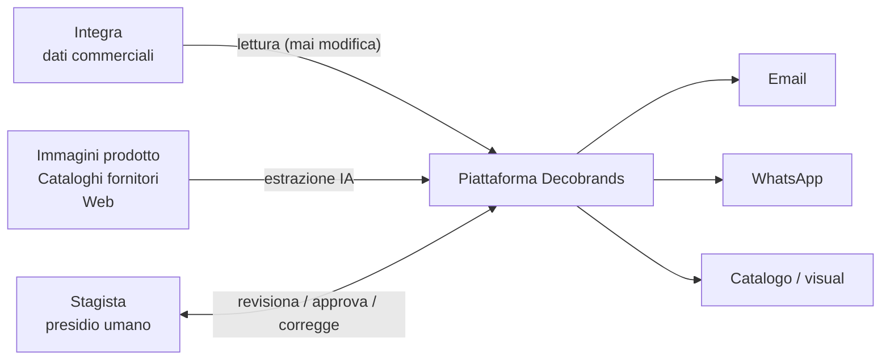
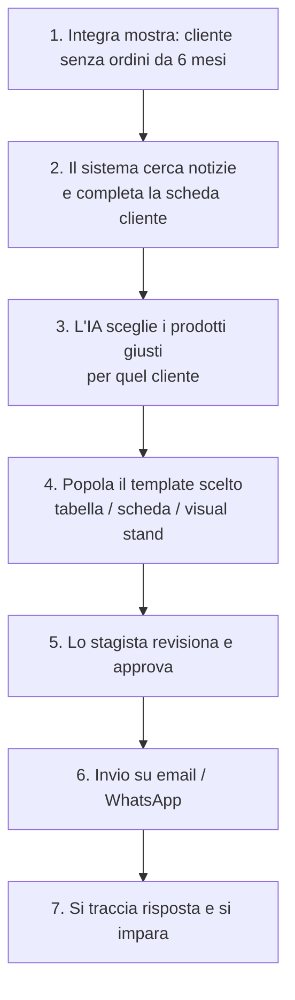
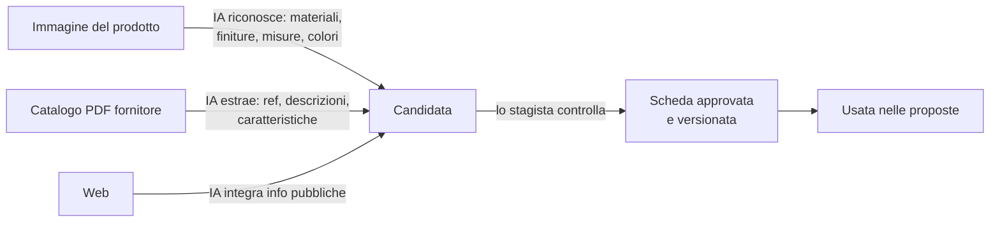
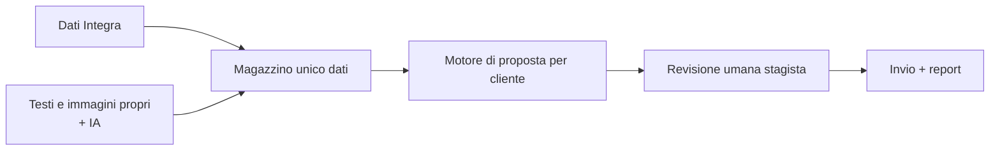

# Decobrands Marketing AI — Panoramica Progetto Marketing AI

> Documento non tecnico. Racconta **cosa fa il sistema**, **cosa fa lo stagista** e **come lavorano insieme**.
> Versione: 1.0 — allineata a specifica-sistema-marketing-ai.md (v1.2) e roadmap-implementazione.md (v1.1)

---

## 1. Il problema in una frase

Il gestionale (**Integra**) contiene i dati commerciali "veri" (clienti, ordini, prodotti, fornitori), ma da solo **non basta a fare marketing**: gran parte di ciò che rende una proposta convincente non c'è — le caratteristiche dei prodotti, le foto, le motivazioni per scegliere un articolo, le notizie sul cliente.

## 2. L'idea

Un sistema che **continua a leggere i dati da Integra** (senza mai toccarli) e li **completa automaticamente** con tutto ciò che manca (dalle immagini dei prodotti, dai cataloghi dei fornitori, dal web). Poi usa tutto insieme per **costruire proposte su misura**, cliente per cliente, e inviarle sui canali giusti (email, WhatsApp, catalogo).

`Un sistema di "impiegato virtuale" che conosce ogni cliente e lo contatta con la proposta giusta — ma sempre con un controllo umano prima dell'invio.`

---

## 3. Cosa fa il sistema (in breve)

| Il sistema fa... | Esempio concreto |
|---|---|
| **Ricorda chi non ha ricontattato** | "Questo cliente non compra da 6 mesi" → contattalo |
| **Sa cosa proporre a chi** | guarda cosa il cliente già compra, cosa piace a clienti simili, quali novità sono arrivate |
| **Completa le informazioni** | estrae materiali, finiture, misure e foto da **immagini prodotto** e dai **cataloghi PDF dei fornitori** |
| **Costruisce la proposta** | tabella articoli, scheda prodotto singola o con varianti, catalogo, visual dello stand allestito |
| **Scrive le comunicazioni** | bozze email/WhatsApp in tono brand, personalizzate per cliente |
| **Invia e traccia** | invia via i canali scelti e registra chi ha aperto/risposto |
| **Impara** | segnala i clienti "novità", i potenziali nuovi rivenditori, chi sta per cambiare fornitore |

## 4. Cosa fa lo stagista (in breve)

Lo stagista è **il "controllo qualità umano"**: il sistema propone, lo stagista **decide**.

| Lo stagista fa... | Perché |
|---|---|
| Compila i dati dove serve la mano umana | inserimento/correzione schede cliente/prodotto/fornitore |
| **Revisiona le estrazioni automatiche** | vede cosa l'IA ha ricavato da un'immagine o da un catalogo e lo **approva o corregge** |
| **Costruisce i modelli grafici** (template) | definisce come sono fatte le nostre comunicazioni (tabella articoli, scheda prodotto, visual) |
| **Modifica i template proposti dall'IA** | l'IA propone un layout → lo stagista lo adatta, o lo scarta |
| Approva prima dell'invio | nulla parte senza il suo ok |

> **Regola d'oro**: l'IA non inventa e non invia nulla. Tutto passa da una **coda di revisione** dove lo stagista decide (spec §6.7, §11.4).

---

## 5. Come lavorano insieme — il giro di lavoro

## 6. Il flusso tipico: "risvegliare un cliente fermo"

## 7. Come nasce una scheda prodotto "parlante"

## 8. Quello che **il sistema non fa mai**

- Non scrive dati commerciali nel gestionale (Integra è **solo in lettura**).
- Non invia nulla **senza l'approvazione** dello stagista.
- Non **inventa** prezzi, codici o dati non verificati (confidenza + fonte).
- Non crea layout/componenti grafici **fuori dalla libreria** definita dallo stagista.

---

## 9. I canali (a partire dai più semplici)

| Canale | Uso |
|---|---|
| **Email** | cataloghi/proposte con grafica ricca, visual |
| **WhatsApp** | contatto diretto e veloce (template approvati) |
| **Catalogo PDF** | documento di riferimento con tabella articoli/variazioni |
| **Visual stand** | foto dello stand del cliente con i prodotti già allestiti (un "effetto wow") |

## 10. Cosa succede "sotto" (senza tecnicismi)

## 11. Prime domande da porsi (per partire bene)

1. Chi fa da **referente** per lo stagista (ufficio marketing / venditore senior)?
2. Da quali **2-3 clienti "fermi"** cominciamo il primo test?
3. Quali prodotti vogliamo **dare in pasto** per primi (i più venduti)?
4. Preferiamo partire dall'**email** o da **WhatsApp**?
5. Con quali **fornitori** facciamo il primo catalogo arricchito?

---

*Documento di sintesi per la direzione. I dettagli tecnici stanno in `specifica-sistema-marketing-ai.md` e la pianificazione operativa in `roadmap-implementazione.md`. Tutti i diagrammi sono in formato Mermaid e possono essere convertiti in immagini da qualsiasi strumento che supporti Mermaid (es. mermaid.live).*
